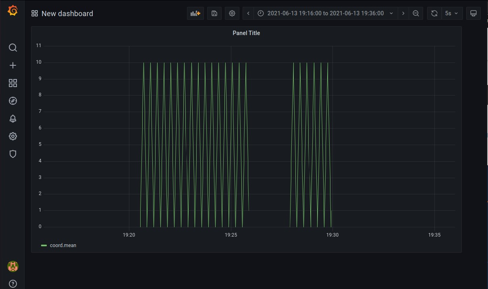

# Пример MQTT

***

## Описание

В проекте показан пример использования MQTT-брокера.

В качестве брокера выбрал сервер Mosquitto MQTT.

MQTT-издателем является Python программа _publisher.py_. Она отправляет числа от 0 до 10 и наоборот.

Используются:
* Приложение на Python
* Mosquitto
* InfluxDB
* Telegraf
* Grafana

---

## Запуск

В терминале необходимо прописать следующие команды для запуска приложений:


```
>>> docker compose build


>>> docker compose up
```

Далее необходимо зайти в _Grafana_ на вашем _localhost:3000_. Там нужно войти в систему со стандартными учетными данными _admin_, _admin_.

Затем перейдите на страницу добавления источника данных, щелкнув _Configuration > Data Sources_ в боковом меню.

Продолжите, выбрав InfluxDB в раскрывающемся меню базы данных временных рядов. Теперь вам нужно настроить источник данных, заполнив поля URL-адреса и базы данных, введя адрес - _http://influxdb:8086_, база данных - _sensors_, логин - _telegraf_ и пароль - _telegraf_.

После нажатия save and test, при успешном подключении возникнем сообщение Data source is working.

Далее нажмите _New dashboard > Add new panel_. Grafana создает базовую панель графиков, которую необходимо настроить с использованием данных InfluxDB. Здесь Вам нужно выбрать _sensors_ в качестве измерения и _coord_ в качестве поля.

---

## Результат


